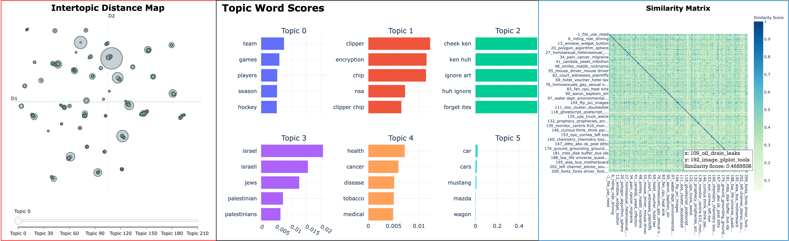

# Fall Quarter 2022 Text Analysis and Machine Learning Bootcamp

Do you want to **learn Python** but don't know how to get started? Attend the Fall Quarter 2022 Text Analysis and Machine Learning Bootcamp! 

This is relaxed, low-stakes environments for beginners who have little or no experience programming in Python and want to learn it for purposes of computational text analysis and machine learning. 

* **Monday, September 19 -** _Learn_ the software needed to program Python on September 19 along with its basic syntax for importing, wrangling, and visualizing data.
    * AM session: 10AM-12PM
    * PM session: 1PM-3PM
* **Wednesday, September 21 -** - _Understand_ basic principles for working with text data and machine learning. 
    * AM session: 10AM-12PM
    * PM session: 1PM-3PM
* **Friday September 23 -** _Deep dive_ into the BERTopic algorithm for topic modeling text.
    * AM session: 10AM-12PM
    * PM session: 1PM-3PM
    
**Registration information coming soon!**

> Hosted by the Text Analysis and Machine Learning Working Group (TAML) at Software and Serivces for Data Science (SSDS) at the Stanford University Cecil H. Green Library. 
