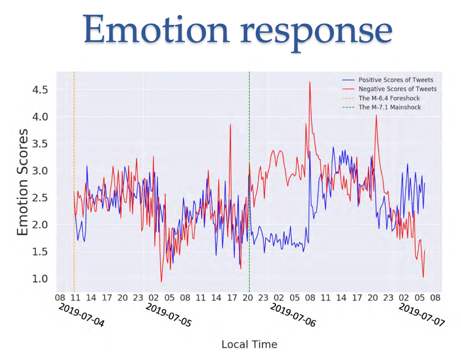

# Guest Speakers

## 2022 January 12

2:00-2:30PM: Welcome and Introductions

2:30-3:30PM: **Title:** Smartphones and Twitter for Earthquakes

**Abstract:** Text analysis and machine learning are useful in many real-world applications. In this presentation, I will mainly talk about two examples I worked on, using sensors inside smartphones to detect earthquakes as well as analyze twitter data to understand the public responses after earthquakes occur. In the first example, the machine learning algorithms we developed can tell the difference between the earthquake's motion and your daily motion, so that the phone can detect earthquakes quickly. In the second example, people’s emotion as well as the topics they were discussing after the Ridgecrest earthquakes can be inferred from the tweets, which shows the power of text analysis.

**Bio:** Dr. Qingkai Kong is a staff scientist at Lawrence Livermore National Laboratory working on machine learning in geosciences. He was a PhD student and an assistant researcher at Berkeley Seismology Lab and is one of the inventors that developed the MyShake project. He later worked as a visiting researcher at Google to help launch the Android Earthquake Alerting System. Currently, his research interests are in combining machine learning with physics knowledge in the domain of seismology. 

**Link to slideshow:** https://github.com/EastBayEv/earthquakes/blob/main/Kong_2022_earthquakes.pdf

3:30-3:45PM: Preview of next session
